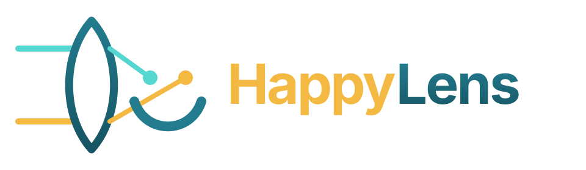
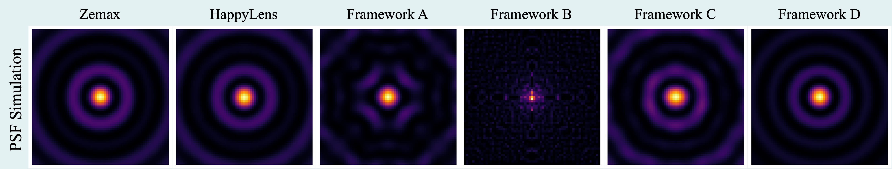
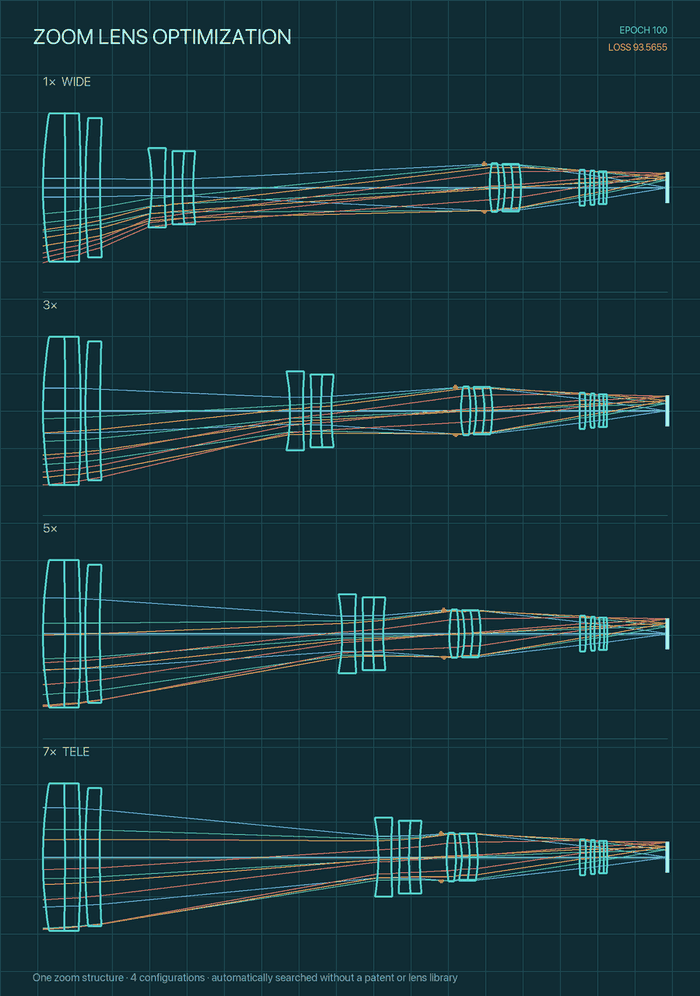
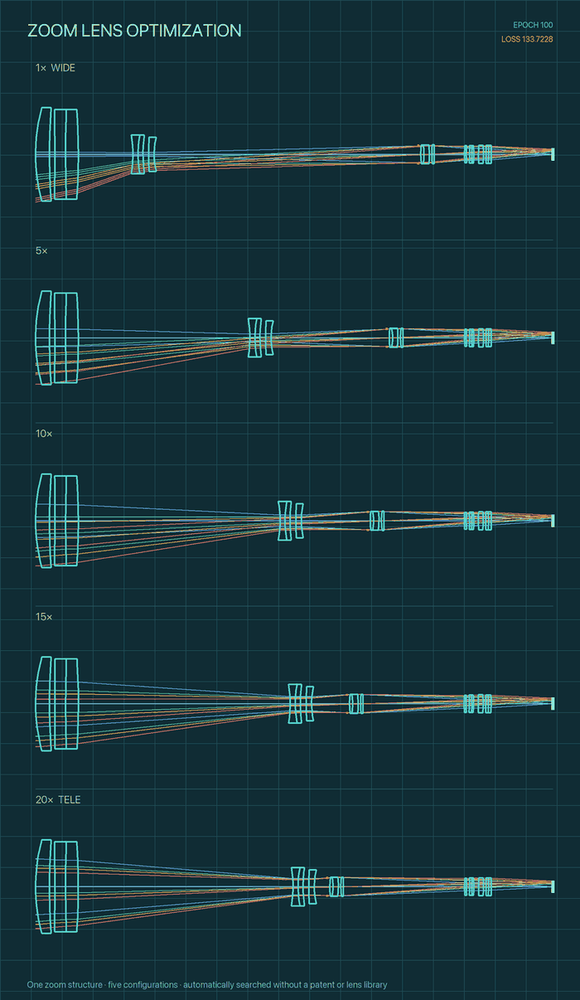
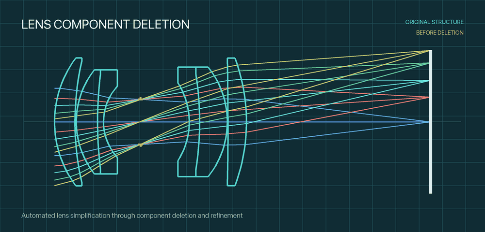
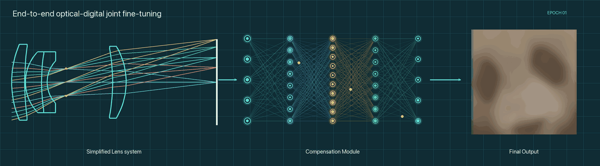
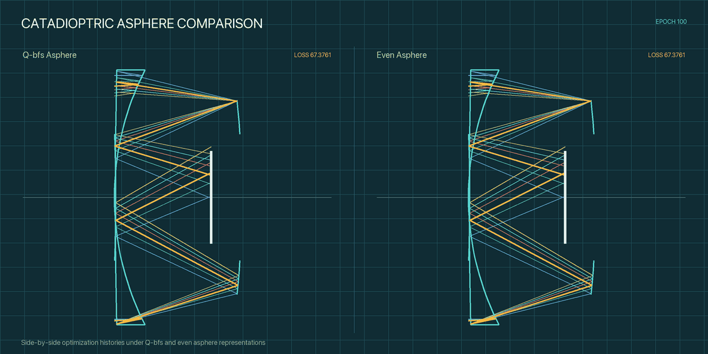
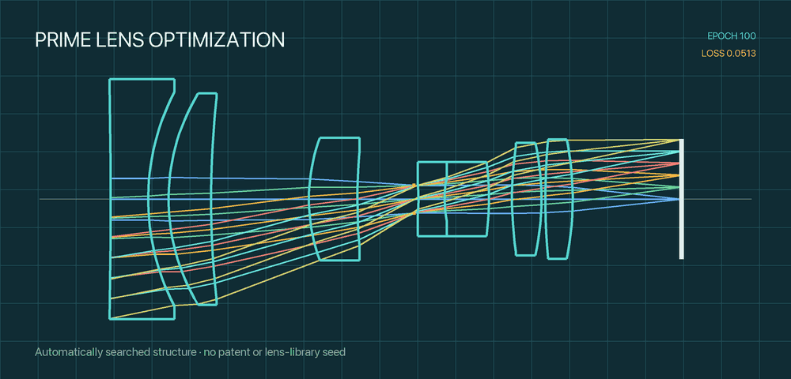
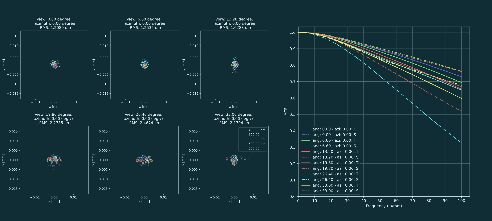

<p align="center">
  <a href="https://wenguanzhang.github.io/HappyLens/">
    
  </a>
</p>

<p align="center">
  <strong>More ways to explore lens design</strong>
</p>

<p align="center">
  <a href="LICENSE">
    
  </a>
  
  
  <a href="https://happylens.readthedocs.io/en/latest/">
    
  </a>
</p>

<p align="center">
  <a href="#-features">Features</a>
  ·
  <a href="#-workflows">Workflows</a>
  ·
  <a href="https://wenguanzhang.github.io/HappyLens/">Website</a>
  ·
  <a href="https://happylens.readthedocs.io/en/latest/">Documentation</a>
  ·
  <a href="#-quick-start">Quick Start</a>
  ·
  <a href="#-related-publications">Publications</a>
  ·
  <a href="#-citation">Citation</a>
</p>

## 🔭 Overview

**HappyLens** is a PyTorch framework focused on optical optimization and automated lens structure search.

HappyLens supports first-order optimization, parallel population-based optimization, heuristic and gradient-based optimizers, and optical systems with multiple configurations. Its structure-search workflows construct candidates from structure descriptors and sampled variables without requiring a patent or lens library as an initialization source.

*Lens design is hard, but we might as well keep smiling while we do it.* 🙂

## ✨ Features

### 🔹 First-order optimization

Search and optimize paraxial representations before constructing a complete surface-level prescription.

### 🔹 Diverse optimizers

Run parallel GPU searches using simulated annealing, genetic algorithms, differential evolution, gradient descent, and other optimization methods.

### 🔹 Multi-configuration support

Optimize prime lenses as well as zoom lenses, internal-focusing lenses, and other optical systems with multiple configurations.

### 🔹 Advanced surface models

Model spherical surfaces, even aspheres, Q-con and Q-bfs aspheres, Binary2 diffractive surfaces, and other complex surface types.

### 🔹 Nested tolerancing

Simulate arbitrarily nested decenter and tilt perturbations across surfaces, elements, and lens groups.

### 🔹 Accurate differentiable imaging

Perform efficient diffraction-aware PSF calculation for accurate, differentiable image simulation and end-to-end joint optimization across optics, ISP, and post-processing networks.

<p align="center">
  
</p>

## 🧭 Workflows

The `test_*` directories are research workflow examples rather than lightweight unit tests. Some require CUDA, external datasets, generated prescriptions, or workflow-specific path/configuration adaptation documented in the gallery. Start with these two structure-generation workflows:

| Workflow | Directory | Description |
| --- | --- | --- |
| Prime lens design | [`test_prime`](test_prime) | Examples of prime-lens structure generation across different focal lengths and f-numbers. |
| Zoom lens design | [`test_zoom`](test_zoom) | Multi-configuration zoom-lens generation examples spanning zoom ratios from 2× to 40×. |

Additional examples cover basic optical analysis, lens-component deletion, nested tolerancing, catadioptric systems, and digital imaging compensation:

- [`test_basic`](test_basic): prescription loading, ray tracing, analysis, and a basic optimization step;
- [`test_del`](test_del): lens-component deletion and optical–digital compensation;
- [`test_cake`](test_cake): micro catadioptric design, nested tolerancing, and digital compensation.

See the [Example Gallery](doc/gallery/introduction.md) for execution assumptions, configuration files, and expected outputs.

## 📚 Documentation

The [online HappyLens documentation](https://happylens.readthedocs.io/en/latest/) includes the user guide, workflow gallery, conventions, configuration format, and API reference. Visit the [project website](https://wenguanzhang.github.io/HappyLens/) for an overview of HappyLens and its featured workflows.

- [Start Here](https://happylens.readthedocs.io/en/latest/start_here.html)
- [Five-minute Quickstart](https://happylens.readthedocs.io/en/latest/quickstart.html)
- [Architecture Overview](https://happylens.readthedocs.io/en/latest/architecture.html)
- [Optical API Reference](https://happylens.readthedocs.io/en/latest/lens_api.html)
- [Imaging and Networks API](https://happylens.readthedocs.io/en/latest/nets_api.html)

Documentation sources are stored in [`doc/`](doc). Read the Docs builds them using [`.readthedocs.yaml`](.readthedocs.yaml).

## ⚡ Quick Start

HappyLens targets **Python 3.12**. Install the PyTorch build appropriate for your CUDA environment, then install the remaining dependencies:

The commands below use `python` for the selected Python 3.12 interpreter. Use `python3` or `py -3.12` instead if that is how Python is exposed on your platform.

```bash
git clone https://github.com/WenguanZhang/HappyLens.git
cd HappyLens
python -m pip install -r requirements.txt
```

Most optical workflows use double precision. Select CUDA when available and fall back to CPU for basic analysis:

```python
import torch
import lens

torch.set_default_dtype(torch.float64)
device = "cuda:0" if torch.cuda.is_available() else "cpu"
torch.set_default_device(device)

cfg = lens.GetYaml("lens_yaml/gauss.yaml")
lens.configure_material_catalog(cfg.MATERIAL_CATALOG)
system = lens.System(
    wavelengths=cfg.WAVELENGTHS,
    waveweights=cfg.WAVEWEIGHTS,
    p_wvl=cfg.P_WAVE,
    max_view=cfg.MAX_VIEW,
    norm_views=cfg.NORM_VIEWS,
    azimuths=cfg.AZIMUTHS,
    file="lens_json/gauss.json",
)

lens.Analysis(system).plot_setup_with_trace()
```

For device selection, tensor conventions, and a complete analysis example, follow the [Quickstart](doc/quickstart.md).

## 🧪 Related Publications

The following publications were developed with HappyLens.

### 🔍 Zoom Lens Structure Search with Differentiable Ray Tracing

📖 *Results in Engineering, 2026* · [Paper](https://www.sciencedirect.com/science/article/pii/S2590123026034262)

We propose **ZED**, an automated framework for searching practical zoom-lens structures from scratch without relying on patent libraries or training datasets.

<p align="center">
  
  
</p>

### 🔍 Lens Component Deletion based on Differentiable Ray Tracing

📖 *IEEE/CVF Conference on Computer Vision and Pattern Recognition (CVPR), 2026* · [Paper](https://openaccess.thecvf.com/content/CVPR2026/html/Zhang_Lens_Component_Deletion_based_on_Differentiable_Ray_Tracing_CVPR_2026_paper.html)

We explore a new approach to lens simplification by identifying and deleting suitable lens components while maintaining imaging quality, providing another route toward more compact and cost-effective optical systems.

<p align="center">
  
</p>

<p align="center">
  
</p>

### 🔍 Differentiable Design and Digital Imaging Compensation for Micro Catadioptric Systems

📖 *Optics Express, 2026* · [Paper](https://doi.org/10.1364/OE.607045)

We extend differentiable lens design to micro catadioptric systems by combining a nested tolerance model with digital imaging compensation, improving robustness to manufacturing and assembly errors.

<p align="center">
  
</p>

### 🔍 End-to-End Automatic Lens Design with a Differentiable Diffraction Model

📖 *Optics Express, 2024* · [Paper](https://opg.optica.org/oe/fulltext.cfm?uri=oe-32-25-44328)

We present an end-to-end framework for automatic prime lens design. The framework jointly optimizes the lens system and image-processing network while accounting for diffraction effects.

<p align="center">
  
</p>

<p align="center">
  
</p>

## 📝 Citation

If HappyLens is useful in your research, please cite the paper or papers closely related to the functionality you use.

```bibtex
@article{zhang2026zoom,
    title = {Zoom lens structure search with differentiable ray tracing},
    journal = {Results in Engineering},
    volume = {32},
    pages = {112408},
    year = {2026},
    issn = {2590-1230},
    doi = {https://doi.org/10.1016/j.rineng.2026.112408},
    url = {https://www.sciencedirect.com/science/article/pii/S2590123026034262},
    author = {Wenguan Zhang and Tuo Sun and Xiangang Gao and Jiajian He and Qirun Zhang and Huajun Feng and Zhihai Xu and Yueting Chen and Shiqi Chen and Qi Li},
    keywords = {Zoom lens design, Differentiable ray tracing, Differential evolution, Gradient descent}
}
```

```bibtex
@InProceedings{zhang2026deletion,
    author    = {Zhang, Wenguan and Zhang, Qirun and Sun, Tuo and He, Jiajian and Xu, Jiahui and Feng, Huajun and Li, Qi},
    title     = {Lens Component Deletion based on Differentiable Ray Tracing},
    booktitle = {Proceedings of the IEEE/CVF Conference on Computer Vision and Pattern Recognition (CVPR)},
    month     = {June},
    year      = {2026},
    pages     = {5637-5646}
}
```

```bibtex
@article{zhang2026catadioptric,
    author = {Wenguan Zhang and Tuo Sun and Xiangang Gao and Jiajian He and Jiahui Xu and Qirun Zhang and Tingting Jiang and Huajun Feng and Yueting Chen and Shiqi Chen and Qi Li},
    journal = {Opt. Express},
    keywords = {Computational imaging; Diffractive optical elements; Imaging systems; Lens design; Optical systems; Systems design},
    number = {18},
    pages = {34256--34270},
    publisher = {Optica Publishing Group},
    title = {Differentiable design and digital imaging compensation for micro catadioptric systems},
    volume = {34},
    month = {Sep},
    year = {2026},
    url = {https://opg.optica.org/oe/abstract.cfm?URI=oe-34-18-34256},
    doi = {10.1364/OE.607045},
}
```

```bibtex
@article{zhang2024automatic,
    author = {Wenguan Zhang and Zheng Ren and Jingwen Zhou and Shiqi Chen and Huajun Feng and Qi Li and Zhihai Xu and Yueting Chen},
    journal = {Opt. Express},
    keywords = {Diffractive optical elements; Imaging systems; Lens design; Optical components; Optical systems; Systems design},
    number = {25},
    pages = {44328--44345},
    publisher = {Optica Publishing Group},
    title = {End-to-end automatic lens design with a differentiable diffraction model},
    volume = {32},
    month = {Dec},
    year = {2024},
    url = {https://opg.optica.org/oe/abstract.cfm?URI=oe-32-25-44328},
    doi = {10.1364/OE.540590}
}
```

## 🚀 Code Release

HappyLens 1.0 was publicly released on **September 1, 2026** under the Apache License 2.0, together with API documentation and prime- and zoom-lens workflow examples.

## 🗺️ Roadmap

- [ ] **User-friendly GUI:** A graphical interface that makes HappyLens more accessible to a broader range of lens designers.
- [ ] **Additional optimization algorithms:** Integrate additional global, heuristic, gradient-based, and hybrid optimization algorithms.

The roadmap reflects current development directions and may evolve as the project grows.

## 📄 License

HappyLens-authored code is released under the [Apache License 2.0](LICENSE). The bundled Restormer, FSNet, and DocDiff adaptations retain their upstream MIT licenses. See [NOTICE](NOTICE), [THIRD_PARTY_NOTICES.md](THIRD_PARTY_NOTICES.md), and [`third_party_licenses`](third_party_licenses) for attribution and license details. Implementations derived from upstream repositories without explicit redistribution licenses are not included.
